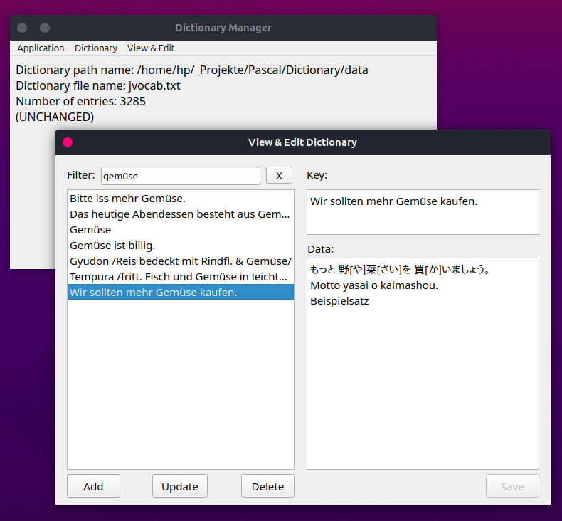

# Dictionary Manager (Pascal)

A simple dictionary manager written in [Free Pascal](https://www.freepascal.org/) with the [Lazarus IDE](https://www.lazarus-ide.org/) for viewing and editing text files with lines in the form:

    key TAB data1 TAB data2 TAB ...

Keys must be unique - when reading the data file, subsequent lines with 
identical keys are ignored.

Screenshot Linux:

The displayed data record is saved as:

	Wir sollten mehr Gemüse kaufen. TAB もっと 野[や]菜[さい]を 買[か]いましょう。 TAB
    Motto yasai o kaimashou. TAB Beispielsatz

