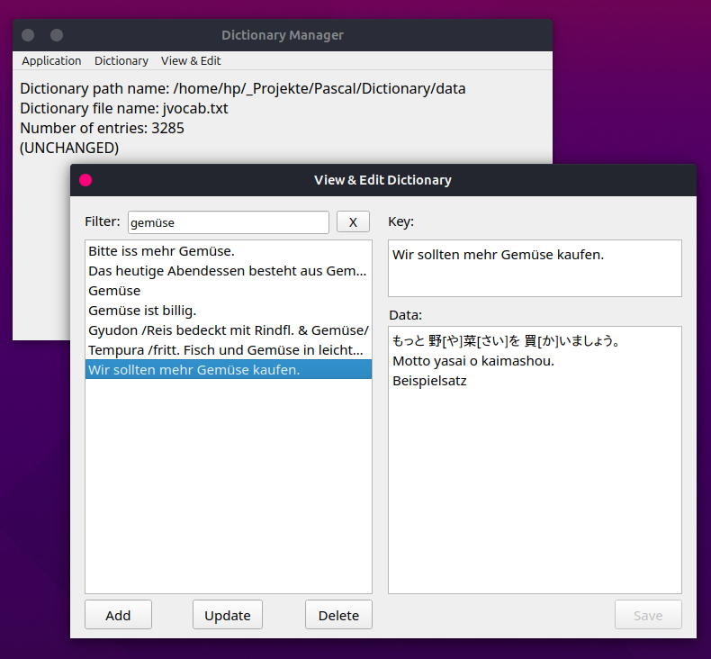

# Dictionary Manager (Pascal)

A simple dictionary manager written in [Free Pascal](https://www.freepascal.org/) with the [Lazarus IDE](https://www.lazarus-ide.org/) for viewing and editing text files with lines in the form:

    key TAB data1 TAB data2 TAB ...

Keys must be unique - when reading the data file, subsequent lines with 
identical keys are ignored.

Screenshot Linux:

The displayed data record is saved as:

	Wir sollten mehr Gemüse kaufen. TAB もっと 野[や]菜[さい]を 買[か]いましょう。 TAB
    Motto yasai o kaimashou. TAB Beispielsatz

The following applies to the file './data/handedict.txt': Chinese-German Dictionary "HanDeDict", License: CC BY-SA 2.0, [Download link](https://handedict.zydeo.net/de/download), file was created Oct. 22, 2025.

-----

### Security Notice

The code I released here into the public domain may appear in third-party projects. I do not maintain, endorse, or have any affiliation with such projects. Any malicious or deceptive use is unauthorized and should be reported to the hosting platform.

-----